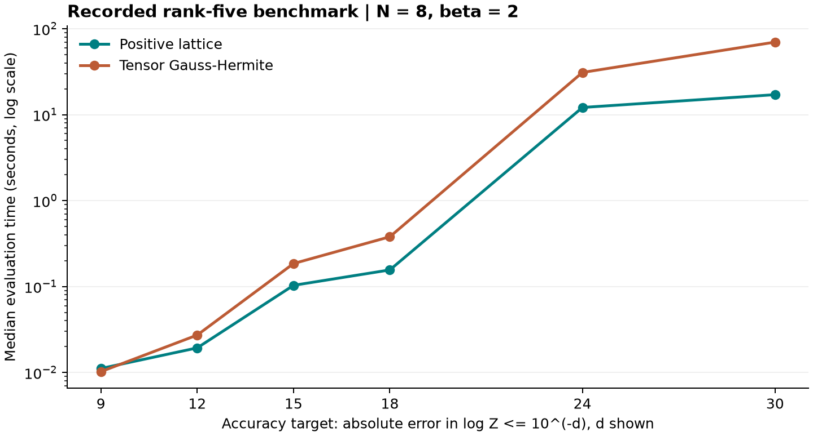
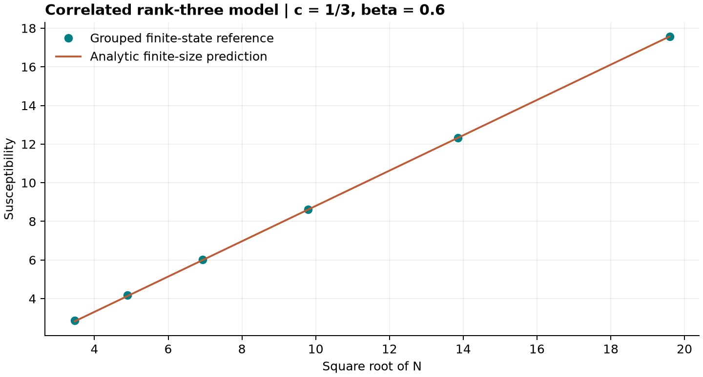

# Hopfield partition functions

**Analytic representations, stable positive sums and reproducible numerical experiments for structured binary models.**

Research prototype. This repository studies integer-weight, low-rank Hopfield/Ising models through complex residues, a positive Gaussian lattice identity, and independent finite-state reference calculations.

## Main findings

- **Positive normalization formula:** an exact infinite lattice representation removes sign cancellation in the partition-function sum. Finite evaluation still requires truncation and rounding control.
- **Precision-runtime comparison:** on one model with $N=8$, $r=5$, $\beta=2$, the positive formula was about **4.09 times faster** than the tested tensor Gauss-Hermite evaluator at an absolute error target of $10^{-30}$ in $\log Z$.
- **Critical observables:** a correlated rank-three example reproduces collective ordering at $\beta_c=0.6$ and a susceptibility of the form $0.9142635791\sqrt{N}-0.3444428364+O(N^{-1/2})$.
- **Limits of descent diagnostics:** suppression of a descendant is distinct from the physical ordering transition; it is not a general retrieval-reliability certificate.

**Scope:** The favorable timings concern the positive reformulation, not the raw complex-residue sum. The rank-five example has only 256 spin states, so direct enumeration is a strong alternative. No industrial-scale advantage, general high-rank solver, or novelty priority is claimed.

## Start here

- [Scientific brief (PDF)](docs/scientific-brief.pdf)
- [Model, identity and proof](docs/mathematics.md)
- [Reproduction guide](docs/reproduction.md)
- [Evidence and limitations](docs/evidence.md)
- [Recorded measurements](results/recorded/high-precision/results.json)
- [Validation performed during packaging](docs/validation.md)

## Quick verification

Use Python 3.12 and install the numerical dependencies:

```bash
python -m venv .venv
source .venv/bin/activate
python -m pip install -r requirements.txt
OPENBLAS_NUM_THREADS=1 python examples/quick_check.py
```

This small example compares the lattice formula with complete spin enumeration and checks a field mean and susceptibility. It does not run the long high-precision benchmark.

## Model and positive identity

The diagonal self interaction is retained:

$$
Z=\sum_{\sigma\in\{-1,+1\}^N}\exp\left[\beta b^T\sigma+\frac{\beta}{2N}\lVert W^T\sigma\rVert^2\right].
$$

For integer $W$, real $b$, and $\beta>0$, define

$$
I(x)=e^{-N\beta\lVert x\rVert^2/2}\prod_i2\cosh[\beta(b_i+W_i\cdot x)],\qquad p_a=\left(\sum_iW_{ia}\right)\bmod2.
$$

Then

$$
Z=G_N(\beta)^{-r}\sum_{k\in\mathbb Z^r}I\left(\frac{p+2k}{N}\right),\qquad G_N(\beta)=\sum_{j\in\mathbb Z}e^{-2\beta j^2/N}.
$$

The proof completes the Gaussian square and uses the common parity of the integer overlaps. The positive evaluator does not enumerate spin configurations. This is a Gaussian/theta-summation identity; its relation to earlier work must be assessed before claiming novelty.

## Recorded high-precision benchmark

| Absolute error target in log Z | Positive (s) | Gauss-Hermite (s) | GH / positive |
|---|---:|---:|---:|
| 1e-9 | 0.011135 | 0.010235 | 0.92x |
| 1e-12 | 0.019338 | 0.027260 | 1.41x |
| 1e-15 | 0.103304 | 0.185221 | 1.79x |
| 1e-18 | 0.156143 | 0.379543 | 2.43x |
| 1e-24 | 12.127928 | 30.994965 | 2.56x |
| 1e-30 | 17.088090 | 69.869946 | 4.09x |



Both methods used matched single-threaded C++ tensor evaluators. Times are medians of three evaluations after one warm evaluation. Model-dependent setup is included; compilation, quadrature-node generation, reference generation and setting selection are excluded. Working arithmetic changes from binary64 to extended precision to binary128. Reference values were checked at 100 and 140 decimal digits. These are recorded results, not a promise of the same runtime on another machine.

At $10^{-30}$ the positive formula visits 25,110,000 points, versus 102,400,000 for Gauss-Hermite. Their similar per-point costs explain the observed speed ratio. See [full benchmark methodology](experiments/high-precision/README.md).

## Critical behavior



The correlated-pattern experiment uses a separate grouped finite-state reference. Grouping exploits repeated rows of the weight matrix and is substantially cheaper than the residue sum in this example. The mean-field scaling is a consistency check, not a claimed new universality class. See [derivation and corrections](experiments/critical-behavior/README.md).

## Repository map

| Directory | Purpose |
|---|---|
| `experiments/positive-lattice` | Positive evaluator, field observables, truncation bounds and residue comparator |
| `experiments/high-precision` | Matched C++ kernels, exact input encoding, quadrature rules and benchmark runner |
| `experiments/critical-behavior` | Correlated patterns, grouped references and critical residue evaluation |
| `experiments/sequential-residues` | Earlier coordinate-by-coordinate residue implementation |
| `experiments/rank-one-descent` | Earlier rank-one descent reconstruction and its limitations |
| `results/recorded` | Preserved original measurements, separate from reruns |
| `scripts` | Plot regeneration and a quick native-kernel accuracy check |
| `docs` | Proof, scientific brief, evidence and reproduction instructions |

## Research directions

Investigate higher rank and larger systems; compare against structure-aware alternatives; improve tensor compression and adaptive truncation; study extensions beyond integer weights; and evaluate a real probabilistic inference workload.

## Provenance and reuse

The package preserves original result files and records source hashes in [provenance.json](results/provenance.json). Packaging changes are listed in [evidence.md](docs/evidence.md). Independent review remains necessary before relying on the implementation for new regimes.

